# _SPAM_
Filter for Spam e-mail

## Problem Description

In the age of digital information, spam email has become an efficient and economically viable tool for commercial advertising. It is said that traditional direct mailers experienced a half to two percent return. For example, In a campaign of a 100 pieces of mail it is said that no more than 2 people will respond and only half of those respondents will purchase a product. Consequently, the need for merchants to reach prospective customer is proportional to the ability to earn revenue. Unlike traditional mailer which can be easily discard with no further consequence to bare, Spam emails may carry malware and other executable files that can be used for identity theft and scams which could lead to long term difficulties for consumers. On the other hand, non-delivery of electronic mail can also carry devastating consequences. The general public has come to rely on electronic communication as the primary method of communication across all facets of their everyday lives. According to a 2012 article in the Huffington Post, Americans spend 20 Billion dollars per year in mitigation, suppression and elimination of spam emails. We observe in a bar plot of our data that a significant amount of e-mail communications (nearly 40%) is Spam. The product of Spam is counter to the benefits of electronic communication. In essence, we can say that 40% of e-mail communication cost 20 Billion dollars.

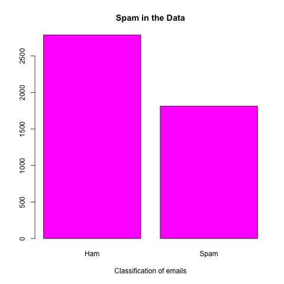
                                
Figure 1 – Nearly 40% of all email communication is spam.

Through careful analysis, We will develop a predictive model to help us understand the data patterns to effeciently dectect Spam emails.
## Goal
   To develop a predictive model that more accurately identify Spam emails.
  
   To reduce the number of false positives (ham emails identified as spam)
## Metrics
  1. The percentage of spam e-mails identified with our model.
  2. The percentage of false positives and True negatives.
## Hypothesis
  1. Each outlying variables (greater than a 20% uniqueness factor) in component one is not a significant factor in identifying and filtering spam.
  2. Each outlying variables (greater than a 20% uniqueness factor) in component two is not a significant factor in identifying and filter spam.
## Data Aproach 

The data was obtain from the Hewlett-Packard Labs. The data is experimental. The data is comprised of a collection of statistical information from a collection of e-mail. The reasoning for the selection of factors (words, characters and frequency partners) for identifying spam emails was not disclosed in the briefing, however, this should not impact the result of our analysis. There was no additional manipulation of the data needed to begin our analysis. Appendix A provides a detailed description of the variables in the data file. The first 54 variables indicate whether a particular word or character was frequently occurring in the e-mail. These are expressed percentages of the total amount of characters or words in the e-mails. The next 3 variables measure the presence of continuous capital letters. Finally, the last variable (V58) is binary and categorical since e-mails can either be HAM or SPAM. All of the variables except for the response (V58) are qualitative.

The principle analysis bi-plot provides a view of all of the emails, with respect to Ham and Spam, across a plane of 57 components. We see that ham emails (represented by the blue dots) spread along component one and the spam emails (represented by the red dots) spread along component two. If we imagine a multiple dimensional plane, the red and blue dots represent the most prevalent points at these components. In other words, the points extend beyond the plane at component two and one respectively, but remain interconnected with other components.

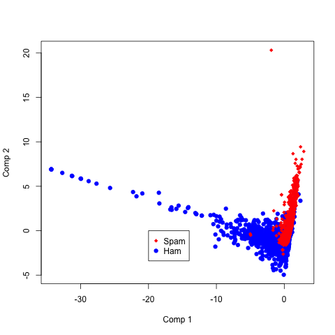 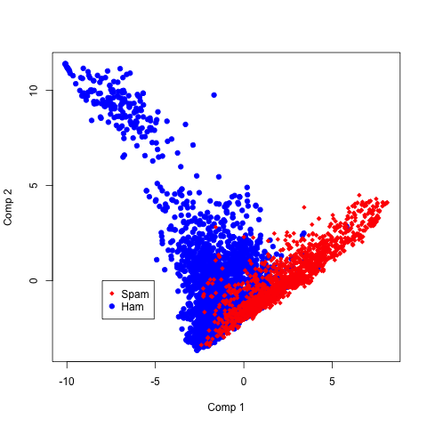

The cumulative variance plot describes the cumulative different in variance between components. For Instance, the graph shows the first two component account for about 20% of the variance. Similarly, the first ten components represent 40% of the variance.
PCA

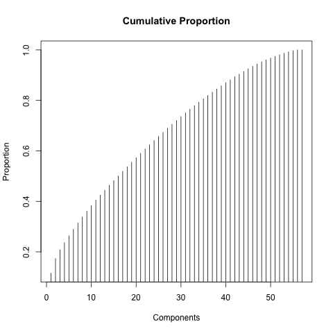 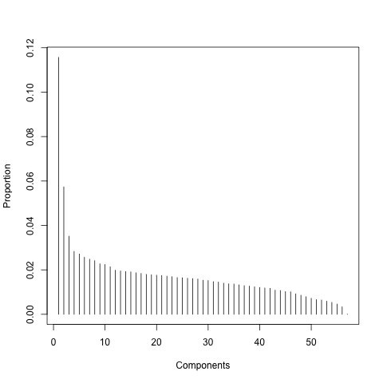

The bar plots shows the outlying variables with a greater than 0.2 uniqueness factor for the first two components.

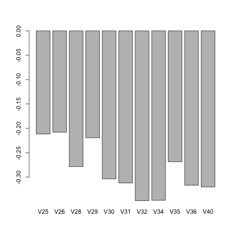 

In a scatter matrix plots of the variables against the response of data is shown below, we observe that distribution of the data is not Gaussian when measured again the response variable. No significant change is noted when the log transform is applied to the response variable.

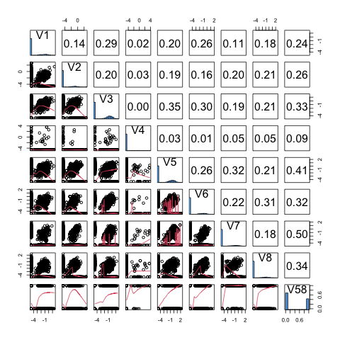 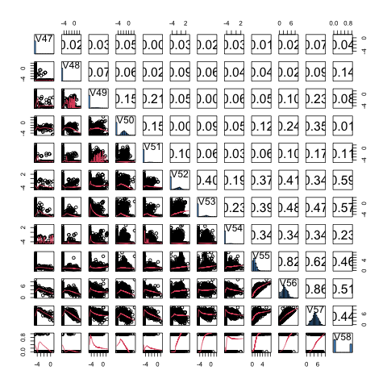

The graphical response of the variables show an “S” like shaped curve. This is in contrast with straight lines we typically associate with Normal distributions. We observe in a boxplot graphs of the variables against the response. We look to see which variables are more discriminatory toward Spam. Larger separation show more discrimination towards spam. We notice the plots in which transformation log is applied allow for better view of the separation in the distribution.
(we see collinearity here - V57.  A Straight line)

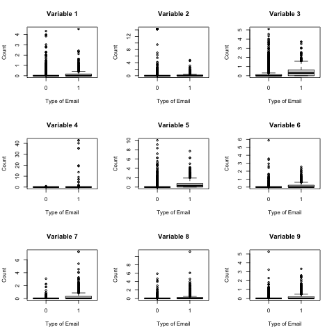 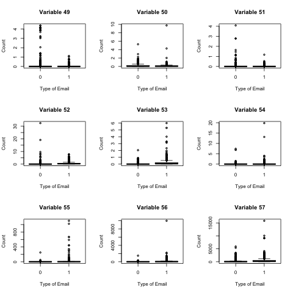
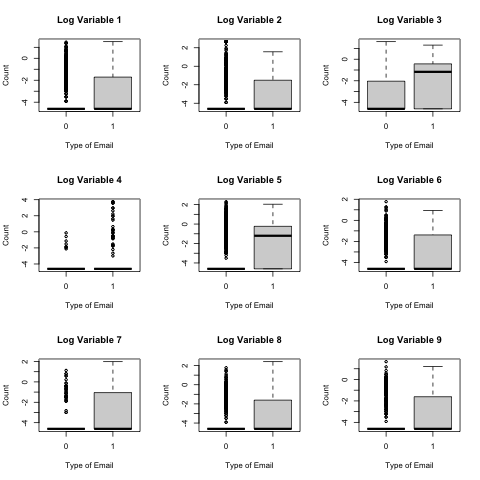  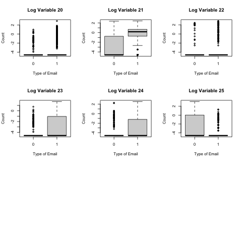

We conclude that the data distribution is binomial given the categorical response variable (Spam or no Spam – 1 or 0) and graphical behavior seeing in log transform plots.

## Data Analysis

With the understanding that the data distribution is binomial, we opt to use generalized linear model in the analysis of the data. We began with a main effective model with and without log transformation. Although we do not expect for a model without log transform to be ideal, we use it reference point. The models use variable 58 as the response and all other variables as predictors. A model utility test was run on both models. The result showed that the number hypothesis could be rejected since the “chi” square metric was diminutive in both cases (2.2E-16). The performance metric for each model are shown below:

     Main Effect w/o Log.         | Main Effect with Log.
      
AIC | 1931.765.              | 1478.782.           
BIC | 2304.939.              | 1851.955.           

The results are as expected. The model with the log transform performed better. This is because the log transform obtains linearity by transforming the probabilities to odds. This linearity allows for ha better scale view of the data that help use better patterns. In essence the log transform flattens what is a multi-dimensional space which in turn allows a better view for analysis. We able to observe this diagnostic plots.

with log Transformartion 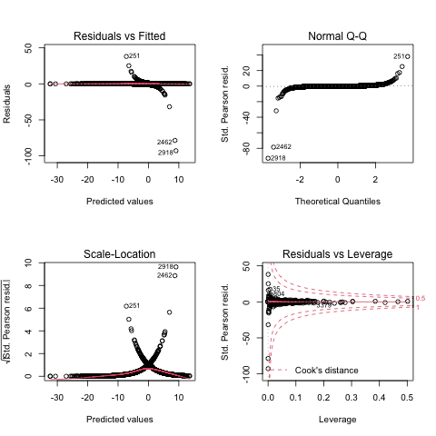  
without log Tansformation 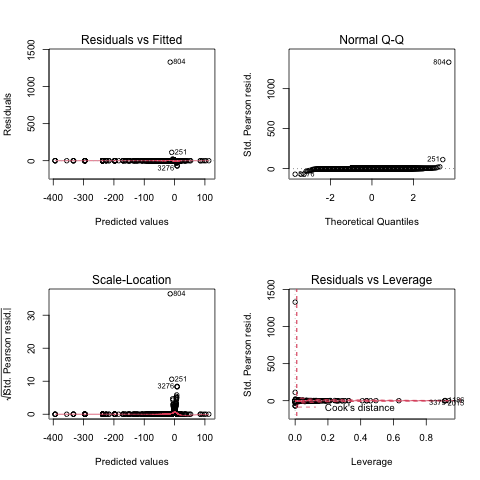

The residuals versus fitted plots shows that all errors appear in straight line. The scale-location plots also show errors in a straights lines that intercept. The analysis shows generalized linear models are a good fit for this scenario.

Given the distribution of the outlying points in the first two components, we theorize removal of variables in component one by in large should improve the model. We attempt manual selection by using the drop term function in conjunction with the update function. We are unable to yield consistent significant improvement. This is because all of the variable coexist in every component in multi-dimensional plane of components. It is difficult to fully understand co-dependencies in the model. It is as if removing cards from a house of cards while attempting to keep the framework in place.

We observe that a significant amounts of the variables contained in component 1 (as shown in blue) are discarded during the automated selection process. In fact, 6 of the 11 variables in this component are removed in the Stepwise main effect with log transform model. It also removed 3 of 8 variables from component 2. This behavior is consistent with the bi plot shown earlier. We again reminded that the blue points which represent ham extend primary along component 1. The red points which represent spam extend primarily along component two. This validates our assumption that removal of some variables with greater influence from component one would improve our model’s performance. A final effort is made to attempt improvement models with drop term function, but no further improve is obtained.

The table below shows that the log transform stepwise model outperformed other models against all metrics.

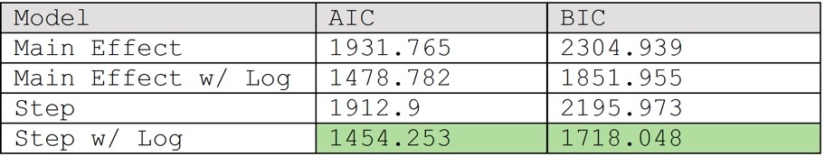

We use the Test Set sampling technique to validate the analysis of our data. In this technique we sample our data by using one-third as an out of sample set for testing and the remaining two-thirds to train or model building. The data is randomly sampled as shown by the following graph:
